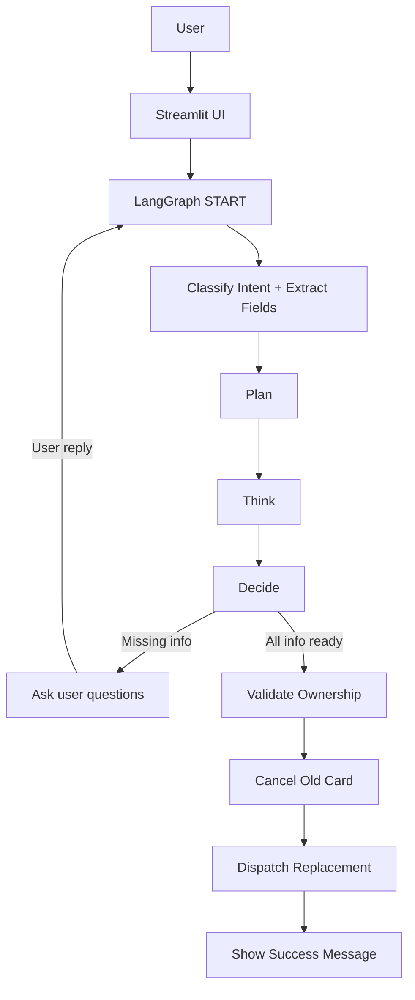

# 💳 Card Replacement Autonomous Agent (LangGraph + Bedrock)

An autonomous agent that helps users replace a credit card. It plans → thinks → decides → acts, asking
for any missing details (reason, address confirmation, delivery confirmation, card selection) and then
validates ownership, cancels the card, and dispatches a replacement. Built with **LangGraph**, **LangChain**,
and **AWS Bedrock (Amazon Titan or compatible)**, and packaged with a **Streamlit UI**.

---

## ✨ Features

- **Multi-card** support with mock data (`data/mock_cards.json`).
- **Autonomous flow**: `plan → think → decision → act` using an LLM on Bedrock.
- **Intent understanding** + information extraction from user messages.
- **Interactive asks** when details are missing (reason, address confirmation, final delivery confirmation).
- **Validates ownership** (mock), **cancels**, then **dispatches** a replacement.
- **Streamlit UI** for easy testing.

---

## 🏗️ Architecture

### High-Level Flow
```
User → Streamlit UI → LangGraph (Classify → Plan → Think → Decide) →
   ├─ ask_user (END; wait for user)
   └─ Validate → Cancel → Dispatch → Finalize (END)
```

### Components
- `agents/state.py` — Typed state for the agent (LangGraph state).
- `agents/policy.py` — Prompts for classify/plan/think/decide.
- `agents/tools.py` — Mock tools: load profile, validate ownership, cancel card, dispatch replacement.
- `agents/graph.py` — Builds the LangGraph with nodes and conditional edges.
- `models/bedrock_llm.py` — LangChain ChatBedrock factory.
- `app/streamlit_app.py` — Streamlit UI.

### Mermaid Diagram


---

## 🚀 Setup & Run

1. **Create and activate a Python env**, then install deps:
   ```bash
   pip install -r requirements.txt
   ```

2. **Configure AWS Bedrock access** (credentials & permissions) and copy `.env.example` to `.env`:
   ```bash
   cp .env.example .env
   # Set AWS_REGION and BEDROCK_MODEL_ID (must be available in your region)
   ```

   Examples for `BEDROCK_MODEL_ID` (check availability per-region):
   - `amazon.titan-text-express-v1`
   - `amazon.titan-text-premier-v1:0`
   - `anthropic.claude-3-5-sonnet-20240620-v1:0`

3. **Run Streamlit**:
   ```bash
   streamlit run app/streamlit_app.py
   ```

4. **Try sample prompts**:
   - *"Replace my CRD-001; mirror broken in accident. Use my saved address; yes dispatch."*
   - *"Replace my Visa ending 1234; deliver to current address."*

---

## 🧠 Autonomy: Plan → Think → Decision → Act

- **Classify**: Extract `intent`, `selected_card_id`, `reason`, `address`, `address_confirmed`, `delivery_confirmed` from user messages.
- **Plan**: LLM proposes a short step plan.
- **Think**: LLM reflects on missing info / risks.
- **Decide**: If any required field is missing → `ask_user`; otherwise continue.
- **Validate** → **Cancel** → **Dispatch** → **Finalize**.

> Final message shown: **"Your card has been successfully cancelled and a new card is dispatched to the confirmed address."**

---

## 🧪 Notes & Customization

- Replace mock tools with **real APIs** for card systems, KYC, address verification, shipping, etc.
- You can hide/show debug outputs from the sidebar.
- This project uses **single-turn segments**: when the agent needs more info it ends; the next user message re-enters the graph with updated state, preventing recursion loops.

---

## 📦 Project Structure

```
card_replacement_agent/
├─ app/
│  ├─ agents/
│  │  ├─ graph.py
│  │  ├─ policy.py
│  │  ├─ state.py
│  │  └─ tools.py
│  ├─ models/
│  │  └─ bedrock_llm.py
│  ├─ data/
│  │  └─ mock_cards.json
│  └─ streamlit_app.py
├─ .env.example
├─ requirements.txt
├─ LICENSE
└─ README.md
```

---

## ❓ FAQ

**Q: I got `GraphRecursionError`.**  
A: This graph ends as soon as it needs more info and re-enters on the next user turn,
which avoids infinite loops. Ensure you are using the provided `streamlit_app.py` runner.

**Q: Model ID not found?**  
A: Bedrock models vary by region/account. Set `BEDROCK_MODEL_ID` to a model available
in your region and with your account’s entitlements.

**Q: Can it handle cancel-only?**  
A: Yes — the intent classifier can surface `cancel_card` too; adjust `DECIDE_PROMPT` if you
want cancel-only to skip dispatch.
